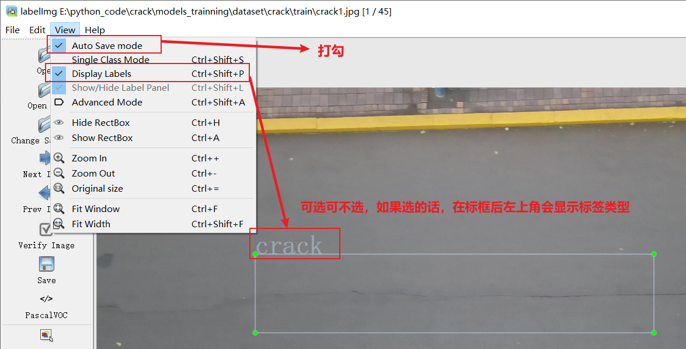
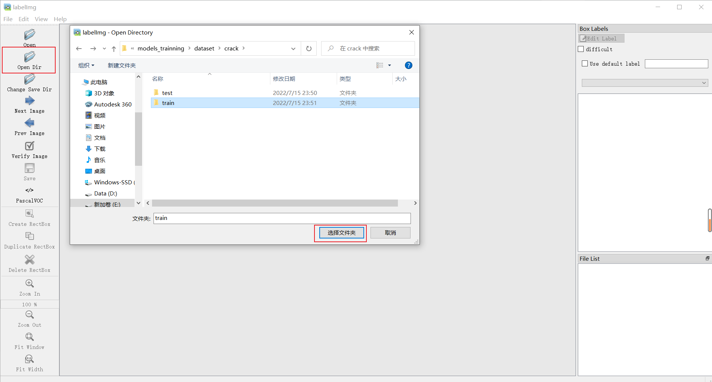
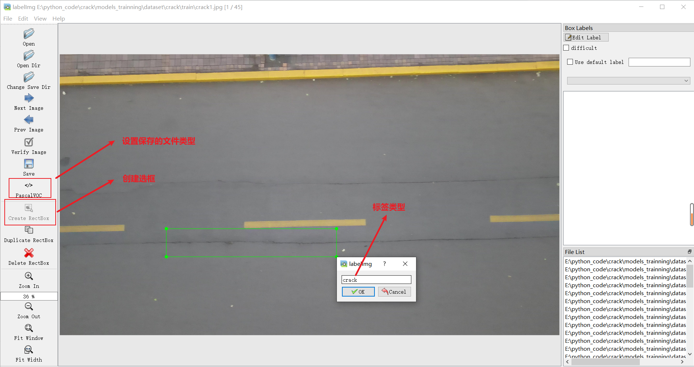

# Labelimg_manual

**文档版本**: 1.0  
**最后更新**: 2025-09-17  
**维护者**: 陳韋立  


## 一、前言

本文档旨在帮助新同事快速上手 Labelimg 软件  

## 二、安裝

在使用環境中開啟terminal,過pip3安裝  

```
pip install labelImg
```

## 三、操作方式

### 1. 啟動Labelimg
在terminal中執行以下代碼開啟 Labelimg 介面  

```
labelimg
```

工具欄名稱介紹
  

在view 中確保 Auto Save Mode 點選，進行自動保存  
  


### 2. 標籤

打開需要標註圖片所在資料夾  
  

點選 Change Save Dir, 選擇標註文件保存目錄  

點選 YOLO/CreateML/PascalVOC 切換保存類型  

開始標記, 畫框, 標記目標的label, 切換下一張繼續  
  


### 3. 快捷鍵

常用快捷鍵:  
a / d 切換前後張圖片  
w 畫框  
Ctrl +/- 縮放圖片  
Ctrl = 原始圖片大小  

  


### 4. 標註注意事項  

#### 4-1 核心原则  

一致性原则：这是最重要的原则。同一含义的样本必须使用完全相同的标签，不同含义的样本必须使用不同的标签。标注前明确定义好每个标签的具体、可操作的边界。  

准确性原则：标签必须真实、准确地反映数据本身的客观事实或预期目标，而非标注员的主观猜测。  

完整性原则：所有需要标注的对象都应被覆盖，不要有遗漏。对于目标检测和图像分割，目标必须被完整框出或勾勒。  

唯一性原则：一个数据项（如一张图片、一段文本）可能对应多个标签（多分类），但一个标注对象（如图中的一个具体物体）在同一个标签体系中通常只应有一个最合适的标签。  

#### 4-2 标签设计规范

标签命名：清晰无歧义：使用简单、明了的词汇，避免使用缩写（除非是领域内公认的）、俚语或可能有多种理解的词汇。  

示例：  
❌ cvd -> ✅ cardiovascular_disease（心血管疾病）  
❌ neg -> ✅ negative_sentiment（负面情感）  

标签体系：  
互斥性：尽可能保证标签之间是互斥的，避免一个样本可以同时属于两个有重叠的标签。如果必须重叠，需明确优先级规则。  
覆盖性：标签集合需要能覆盖所有可能的情况。建议 always 设置一个 other 或 unknown 标签来处理无法归类或边界模糊的样本。  
层级结构：对于复杂场景，建议使用层级标签结构（如 一级标签：二级标签），例如 vehicle:car, vehicle:truck。这为模型提供了更丰富的信息。  

#### 4-3 具体任务标注指南

图像分类：  
标签应基于图像的整体内容。如果图像中包含多个主要对象，可打上多个标签（多标签分类）。  
对于模糊或不明确的图像，应有一个明确的规则（如：low_quality 或 uncertain），而不是随意猜测。  

目标检测（Bounding Box）：  
紧密度：框体应尽可能紧密地贴合目标物体的最外层边缘。  
完整性：必须将整个目标物体框住，包括其不可分割的部分。  
最小单位：明确标注的最小单位（例如，标注“人”而不是“人头+身体”）。  

** occlusion处理：对于被遮挡的物体，仍需标注其可见部分**，并根据规则判断是否标注为一个完整实体。  

图像分割（Segmentation）：  
沿物体轮廓进行精确标注，像素级精度要求高。  
处理好物体边缘和遮挡关系。  

文本分类：  
标签应基于文本的整体意图或主题，而不是其中的某个词。  
对于长文本，可能包含多个意图，需根据规则判断是选择主意图还是打上多个标签。   

命名实体识别：  
实体边界要准确，不多标也不少标。  
实体类型要正确。提前定义好实体词典或规则有助于保持一致性。  

#### 4-4 质量控制与流程

编写标注指南：在开始大规模标注前，必须撰写详细的《标注指南文档》，包含每个标签的定义、正例、反例和边界案例（Edge Cases）的处理方式。  


样本选择：  
数据应尽可能代表真实的应用场景，包括各种 corner cases（光照变化、遮挡、模糊、罕见类别等）。  
避免引入选择偏差（例如，只标注“好看”的图片）。  

审核机制：  
建立多级审核制度（标注员 -> 审核员 -> 仲裁员）。  
定期进行一致性检验（例如，将同一批样本分给多个标注员标注，计算Kappa系数等指标），评估标注质量。  
迭代反馈：与算法团队保持密切沟通。当模型在某个标签上表现持续不佳时，很可能是标注出现了系统性问题，需要回溯检查标注质量。  

#### 4-5 常见陷阱与禁忌

禁止猜测：对于不确定如何标注的样本，应记录下来并集中讨论，由项目负责人或专家进行仲裁，而不是凭感觉标注。  

避免标签偏差：确保每个标签都有足够数量的样本，避免某些标签数据极少（样本不均衡）。  

谨慎处理“垃圾”数据：对于模糊、低质、无意义的样本，应统一归为 invalid 或 junk 标签并从训练集中剔除，而不是强行赋予一个业务标签。  